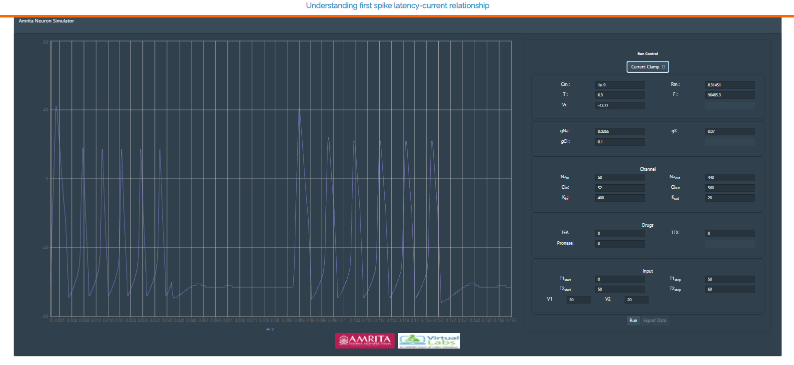

### Procedure

•	Experiment focuses to study the dynamics of delayed rectifier potassium current.

•	The GUI allows the user to provide their choice for  current clamp or voltage clamp by clicking on the “Run control” radio buttons. 

 &nbsp;

•	User can change the parameters like Cm=Membrane Capacitance (nF), Rm  = Membrane resistance (MΩ),Vr  = Resting Voltage (mV),T = Temperature (0C) and F= Frequency. 

 &nbsp;

•	The conductance of ion channels that generate an action potential can also change in the simulator ie gNa = Conductance of Sodium ions, gK= Conductance of Potassium ions, gCl= Conductance of Chloride ions.

 &nbsp;

•	User can provide internal or external ionic concentration (Sodium, chloride and potassium) in voltage gated ion channel simulator by clicking on “channel” window and understand the membrane properties of ion channels which generate an action potential.

 &nbsp;

•	The GUI also allows the user to provide varying time ranges as input parameters. T1 = Time (T1 start, suppose 10 s and T2 stop 20s). The simulator will read the output from 10s to 20s. Likewise T2 Start and T2 Stop can be given according to users choice. V1 and V2 indicates applied voltage at the specified time duration. 

 &nbsp;

•	After providing all parameter values in the GUI, user can click on “RUN” radio button to generate the action potential and by providing different input stimulus user can understand the first spike latency modulation via modeled neuron simulator.

•	If a user provides a transmembrane voltage as current clamp and their choice of parameters in the respective radio buttons, the generated action potential was observed as:

 &nbsp;
When user disables fast sodium channel, the depolarization decreases to very low level. Delayed rectifier current gets plotted and observed as output.

